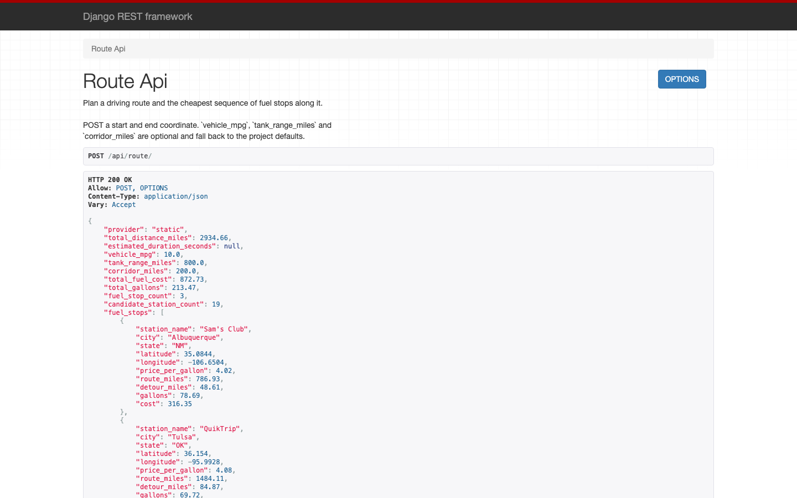
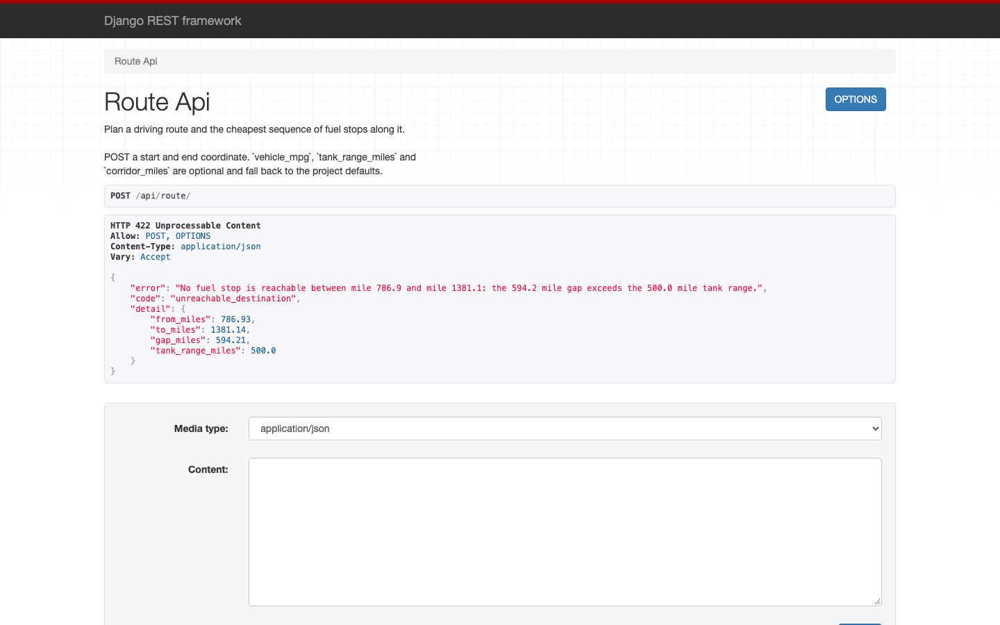
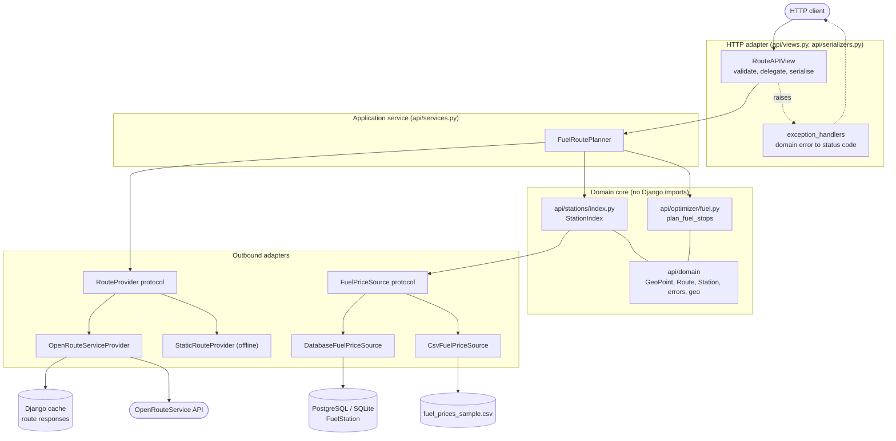
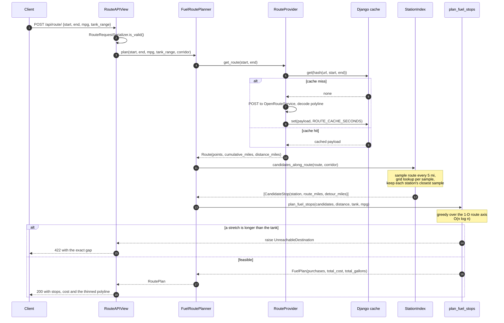

# Fuel-Optimised Route Planner

A Django REST API that plans a driving route between two coordinates and works out
the cheapest way to fuel the trip: where to stop, how much to buy at each stop, and
what the whole journey costs. Routes come from a pluggable provider
(OpenRouteService by default); fuel prices come from a CSV catalogue loaded into the
database.

The interesting part is the optimiser. Projecting fuel stations onto the route turns
the problem into the classic *gas station problem*, which has a provably optimal
greedy solution — see [Design notes](#design-notes).

---

## Captured output

The full transcript, including the error cases, is in
[`docs/api-examples.md`](docs/api-examples.md). A representative request and
response:

```console
$ curl -s -X POST http://localhost:8370/api/route/ \
    -H "Content-Type: application/json" \
    -d '{"start_lat": 34.05233, "start_lng": -118.24356,
         "end_lat": 40.71278, "end_lng": -74.00600,
         "vehicle_mpg": 10, "tank_range_miles": 800, "corridor_miles": 200}'
{
    "provider": "static",
    "total_distance_miles": 2934.66,
    "estimated_duration_seconds": null,
    "vehicle_mpg": 10.0,
    "tank_range_miles": 800.0,
    "corridor_miles": 200.0,
    "total_fuel_cost": 872.73,
    "total_gallons": 213.47,
    "fuel_stop_count": 3,
    "candidate_station_count": 19,
    "fuel_stops": [
        {
            "station_name": "Sam's Club",
            "city": "Albuquerque",
            "state": "NM",
            "latitude": 35.0844,
            "longitude": -106.6504,
            "price_per_gallon": 4.02,
            "route_miles": 786.93,
            "detour_miles": 48.61,
            "gallons": 78.69,
            "cost": 316.35
        },
        {
            "station_name": "QuikTrip",
            "city": "Tulsa",
            "state": "OK",
            "latitude": 36.154,
            "longitude": -95.9928,
            "price_per_gallon": 4.08,
            "route_miles": 1484.11,
            "detour_miles": 84.87,
            "gallons": 69.72,
            "cost": 284.45
        },
        {
            "station_name": "Speedway",
            "city": "Indianapolis",
            "state": "IN",
            "latitude": 39.7684,
            "longitude": -86.1581,
            "price_per_gallon": 4.18,
            "route_miles": 2167.39,
            "detour_miles": 60.04,
            "gallons": 65.06,
            "cost": 271.93
        }
    ],
    "route": [
        [34.05233, -118.24356],
        [35.38442, -109.39604800000001],
        [36.71651, -100.548536],
        [38.0486, -91.701024],
        [39.38069, -82.853512],
        [40.71278, -74.006]
    ],
    "route_points_returned": 6,
    "route_points_total": 201
}
```

> The `route` array is reformatted onto one line per point for readability and the
> server was started with `MAX_ROUTE_POINTS_RETURNED=6` so it fits here; the default
> is 2000. Every value above is from the run captured in
> [`docs/api-examples.md`](docs/api-examples.md).

When the vehicle physically cannot make the trip, the API says exactly where it
runs out rather than returning a plan that does not work:

```console
$ curl -s -X POST http://localhost:8370/api/route/ \
    -H "Content-Type: application/json" \
    -d '{"start_lat": 34.05233, "start_lng": -118.24356,
         "end_lat": 40.71278, "end_lng": -74.00600,
         "tank_range_miles": 500, "corridor_miles": 200}'
{
    "error": "No fuel stop is reachable between mile 786.9 and mile 1381.1: the 594.2 mile gap exceeds the 500.0 mile tank range.",
    "code": "unreachable_destination",
    "detail": {
        "from_miles": 786.93,
        "to_miles": 1381.14,
        "gap_miles": 594.21,
        "tank_range_miles": 500.0
    }
}
```

The same two responses in DRF's browsable API:





---

## Architecture

The shape is a **hexagonal / ports-and-adapters** layering. A framework-free domain
core (`api/domain`, `api/optimizer`) is surrounded by adapters — a routing provider,
a fuel-price source, HTTP — each behind a small protocol. `api/services.py` is the
single application service that composes them; views do nothing but validate,
delegate and serialise.



Dependencies point inward: `api/domain` and `api/optimizer` import nothing from
Django, so the optimiser can be tested with plain values and no database.

## Request flow



---

## Quickstart

### Docker (recommended)

```bash
docker compose up --build
```

That starts PostgreSQL, applies migrations, seeds the station catalogue from
`fuel_prices_sample.csv`, and serves the API on **http://localhost:8370/api/**.
No manual steps. `docker-compose.yml` defaults `ROUTE_PROVIDER` to the offline
`StaticRouteProvider`, so the stack is fully functional out of the box with no API
key.

```bash
curl http://localhost:8370/api/health/
```

To use real road routing, put your key in the environment before bringing the stack
up:

```bash
ORS_API_KEY=your-key \
  ROUTE_PROVIDER=api.routing.openrouteservice.OpenRouteServiceProvider \
  docker compose up --build
```

Tear down with `docker compose down -v`.

### Without Docker

```bash
python -m venv .venv && source .venv/bin/activate
pip install -r requirements.txt
cp .env.example .env            # optional; the defaults work as-is
python manage.py migrate        # SQLite by default
python manage.py load_fuel_data
ROUTE_PROVIDER=api.routing.static.StaticRouteProvider python manage.py runserver 8370
```

---

## Configuration

Every setting is read from the environment, optionally via a `.env` file. All of
them are optional — with an empty environment the project runs on SQLite with the
offline routing provider.

| Variable | Required | Default | What it does |
| --- | --- | --- | --- |
| `DJANGO_SECRET_KEY` | for production | insecure dev key | Django signing key. |
| `DJANGO_DEBUG` | no | `true` | Debug mode. Set `false` in production. |
| `DJANGO_ALLOWED_HOSTS` | no | `localhost,127.0.0.1,[::1]` | Comma-separated allowed hosts. |
| `DJANGO_CSRF_TRUSTED_ORIGINS` | no | *(empty)* | Comma-separated trusted origins. |
| `DB_ENGINE` | no | `sqlite` | `sqlite` or `postgres`. |
| `DB_NAME` | no | `fuel_routes` / `db.sqlite3` | Database name or SQLite path. |
| `DB_USER` | no | `postgres` | PostgreSQL user. |
| `DB_PASSWORD` | no | *(empty)* | PostgreSQL password. |
| `DB_HOST` | no | `localhost` | PostgreSQL host. |
| `DB_PORT` | no | `5432` | PostgreSQL port. |
| `DB_CONN_MAX_AGE` | no | `60` | Seconds to keep a database connection alive. |
| `CACHE_BACKEND` | no | `locmem` | Django cache backend; point at Redis/Memcached to share the route cache across workers. |
| `CACHE_LOCATION` | no | `fuel-routes` | Cache location/DSN. |
| `ROUTE_PROVIDER` | no | `api.routing.openrouteservice.OpenRouteServiceProvider` | Dotted path to the routing adapter. |
| `ORS_API_KEY` | for real routing | *(empty)* | OpenRouteService key. Without it the ORS provider returns HTTP 503. |
| `ORS_URL` | no | ORS driving-car directions | Endpoint to call. |
| `ORS_TIMEOUT_SECONDS` | no | `10` | Upstream timeout; exceeded means HTTP 504. |
| `ORS_POLYLINE_PRECISION` | no | `5` | Encoded-polyline precision. |
| `ROUTE_CACHE_SECONDS` | no | `3600` | TTL for cached routes; `0` disables caching. |
| `FUEL_PRICE_SOURCE` | no | `api.stations.database.DatabaseFuelPriceSource` | Dotted path to the price adapter. |
| `FUEL_PRICES_CSV` | no | `fuel_prices_sample.csv` | CSV used by the loader and the CSV source. |
| `STATION_INDEX_CACHE_SECONDS` | no | `300` | How long the in-memory station index is reused. |
| `STATION_GRID_CELL_DEGREES` | no | `0.5` | Grid cell size for the spatial index. |
| `DEFAULT_VEHICLE_MPG` | no | `10` | Fallback when the request omits `vehicle_mpg`. |
| `DEFAULT_TANK_RANGE_MILES` | no | `500` | Fallback when the request omits `tank_range_miles`. |
| `FUEL_STOP_CORRIDOR_MILES` | no | `50` | How far off the route a station may be. |
| `ROUTE_SAMPLE_SPACING_MILES` | no | `5` | Spacing of the route samples used for station matching. |
| `MAX_ROUTE_POINTS_RETURNED` | no | `2000` | Cap on the polyline returned in the response. |

---

## API

### `POST /api/route/`

| Field | Required | Default | Notes |
| --- | --- | --- | --- |
| `start_lat`, `start_lng` | yes | — | Origin, decimal degrees. |
| `end_lat`, `end_lng` | yes | — | Destination; must differ from the origin. |
| `vehicle_mpg` | no | `DEFAULT_VEHICLE_MPG` | 0.1 – 200. |
| `tank_range_miles` | no | `DEFAULT_TANK_RANGE_MILES` | 1 – 5000. |
| `corridor_miles` | no | `FUEL_STOP_CORRIDOR_MILES` | 1 – 250. |

| Status | When |
| --- | --- |
| `200` | A plan was produced. |
| `400` | The request body failed validation. |
| `404` | The provider found no drivable route. |
| `422` | `unreachable_destination` or `no_fuel_stations_available`. |
| `502` | The routing provider failed. |
| `503` | The routing provider is not configured (no API key). |
| `504` | The routing provider timed out. |

### `GET /api/health/`

Returns `{"status": "ok", "route_provider": ..., "route_provider_configured": ...}`.
Used by the container healthcheck.

---

## Development

```bash
pip install -r requirements-dev.txt

python manage.py test          # Django's runner: 120 tests, no extra dependencies
pytest                         # same suite under pytest
pytest --cov=api               # with coverage

ruff check .                   # lint
ruff format .                  # format
python manage.py benchmark_planner   # reproduce the numbers in Design notes
```

The suite runs on SQLite, makes **no network calls**, and passes with no
`ORS_API_KEY` set — the OpenRouteService client is exercised entirely against a fake
`requests` session. Current state (captured in [`docs/test-run.txt`](docs/test-run.txt)):
120 tests, all passing, 99% statement coverage of application code.

---

## Project structure

```
api/
  domain/            # framework-free core; imports nothing from Django
    types.py         #   GeoPoint, Route, Station, CandidateStop, FuelPlan
    geo.py           #   haversine, cumulative distance, sampling, downsampling
    errors.py        #   the exceptions the application raises deliberately
  optimizer/
    fuel.py          # plan_fuel_stops: the cost-optimal greedy. Read this first.
  routing/           # outbound adapter: coordinates -> Route
    base.py          #   RouteProvider protocol (the extension seam)
    openrouteservice.py
    static.py        #   offline great-circle provider; no key, no network
  stations/          # outbound adapter: the station catalogue
    base.py          #   FuelPriceSource protocol (the second seam)
    database.py      #   reads api.models.FuelStation
    csv_source.py    #   streams a CSV
    index.py         #   uniform-grid spatial index + projection onto a route
  services.py        # FuelRoutePlanner: the one place the pieces are composed
  views.py           # thin HTTP layer
  serializers.py     # request validation and response shaping
  exception_handlers.py  # domain error -> HTTP status, in one table
  signals.py         # invalidate memoised collaborators on setting changes
  management/commands/
    load_fuel_data.py    # idempotent, batched CSV import
    benchmark_planner.py # reproduces the Design-notes measurements
  tests/             # 120 tests; doubles.py holds every fake
map_API/             # Django project: settings, urls, wsgi/asgi
docs/                # captured output, benchmark run, screenshots
fuel_prices_sample.csv
```

---

## Design notes

### The optimiser is the point

Once stations are projected onto the route the geography disappears and what is left
is the **gas station problem**: drive from mile 0 to mile *D*, tank holds *R* miles
of fuel and starts full, fuel at mile `p_i` costs `c_i` per gallon, minimise the
spend. Because fuel is divisible the problem admits an optimal greedy solution.

Standing at station *i* with `f` miles of range and window *W* = stations within *R*:

1. If any station in *W* costs no more than `c_i`, take the **first** one and buy
   exactly enough to reach it. Buying more would carry expensive fuel past a cheaper
   pump.
2. Otherwise `c_i` is the cheapest price in the whole window: **fill the tank** and
   drive to the cheapest station in *W* (the farthest one on a tie).

The destination is modelled as a sentinel priced at $0 and the origin as a sentinel
priced at infinity, which makes the final leg and the free starting tank fall out of
rule 1 with no special cases.

**Why it is optimal.** Total fuel burned is fixed at `D / mpg` regardless of the
plan, so minimising cost means buying every gallon at the cheapest price that can
physically deliver it to where it is burned. Rule 1 never carries a gallon past a
cheaper pump; rule 2 fires only when no cheaper pump is reachable. An exchange
argument converts any optimal plan into this one without increasing cost.

**Complexity.** `next_no_more_expensive` is a single monotonic-stack pass, O(n); a
sparse table answers "cheapest in `[l, r]`" in O(1) after an O(n log n) build; the
window edge is a binary search and each step moves strictly forward. Total
**O(n log n)** for *n* candidate stops. The naive version — rescanning the window at
each station — is O(n·|W|), which degenerates to quadratic exactly in the
cross-country case the brief asks about.

**Edge cases**, each with a test in `api/tests/test_optimizer.py`:

| Case | Behaviour |
| --- | --- |
| Route shorter than one tank | No stops, `$0`. The starting tank is not charged for. |
| Gap between stations wider than the tank | `UnreachableDestination` naming the exact gap → HTTP 422. |
| Final leg longer than the tank | Same check; the destination is just another node. |
| No station within the corridor at all | `NoFuelStationsAvailable` → HTTP 422. |
| Several equally cheap stations | Deterministic: the farthest one, so no redundant stop. |
| Station exactly at the range limit | Reachable (inclusive comparison, epsilon-tolerant). |
| Two stations at the same mile marker | Handled; the cheaper wins. |

Correctness is not asserted by hand-picked examples alone: `OptimalityTests` compares
the greedy against an exhaustive dynamic programme over `(station, integer fuel
level)` on 150 randomly generated instances and requires the costs to match exactly.

### Scalability: what was actually slow

The original implementation issued a bounding-box **database query per polyline
segment** whenever the tank dipped below a safety buffer, and if no station was found
it never refuelled — so the query fired again on the next segment, and the next, for
the rest of the route. On a cross-country ORS polyline that is tens of thousands of
round-trips for data that changes once a day. It then loaded the entire station table
into Python to find a minimum price.

The fix is structural rather than clever:

* **Load the catalogue once**, into a uniform lat/lng grid (`StationIndex`), memoised
  per process for `STATION_INDEX_CACHE_SECONDS`. Zero queries per request in the warm
  case.
* **Match stations by sampling the route** every `ROUTE_SAMPLE_SPACING_MILES` rather
  than at every vertex, with the search radius widened by half the spacing so nothing
  inside the corridor is lost (there is a test for that).
* **Cache routing responses** keyed on the endpoints rounded to ~11 m. Re-planning the
  same trip with a different MPG costs no ORS quota.
* **Bound the response**: the polyline is thinned to `MAX_ROUTE_POINTS_RETURNED`
  points, with the original count reported alongside. A full cross-country ORS
  geometry is otherwise the largest thing in the payload by an order of magnitude.
* **Index the table**: a composite `(latitude, longitude)` index and a price index,
  plus a uniqueness constraint on the station identity.

Measured with `python manage.py benchmark_planner` on Apple Silicon, CPython 3.14.5
(full output in [`docs/benchmark.txt`](docs/benchmark.txt)):

| Catalogue | Grid lookup (50 mi) | Linear scan | Speed-up |
| --- | --- | --- | --- |
| 1,000 stations | 0.003 ms | 0.486 ms | ~151x |
| 10,000 stations | 0.011 ms | 4.863 ms | ~431x |
| 100,000 stations | 0.130 ms | 48.768 ms | ~375x |

End to end, Los Angeles to New York (2,935 miles) against a synthetic 100,000-station
catalogue: index build 19.0 ms (once, then reused), corridor matching 58.6 ms, 4,820
candidate stops, optimisation 6.0 ms. The optimiser alone handles 100,000 candidates
in ~132 ms.

The remaining bottleneck is the outbound ORS call, which is network-bound and already
cached. If the catalogue grew past what fits comfortably in memory the next step would
be PostGIS with a GiST index on a geography column, or precomputing station-to-corridor
membership per highway segment — neither is warranted at this data size.

### Extensibility: two seams, not five

* **`RouteProvider`** (`api/routing/base.py`) — coordinates in, `Route` out. Swapping
  ORS for Mapbox, Valhalla or an in-house engine is a new class plus a `ROUTE_PROVIDER`
  change. `StaticRouteProvider` is the in-repo second implementation that proves the
  seam is real, and it is what makes the app runnable and demonstrable with no API key.
* **`FuelPriceSource`** (`api/stations/base.py`) — "give me every station you know
  about". `DatabaseFuelPriceSource` and `CsvFuelPriceSource` both implement it; a
  vendor price feed would be a third.

Both are resolved by dotted path through `django.utils.module_loading.import_string`,
memoised, and invalidated on `setting_changed`. No plugin registry, no entry points —
this data size and this problem do not need them.

### Other decisions

* **The starting tank is free.** The vehicle begins full and pays only for fuel bought
  en route, so a trip shorter than one tank costs $0. That is the natural reading of
  "the cost of the fuel stops"; charging for the initial tank would require a price at
  the origin that the data does not have.
* **Detour miles are reported, not charged.** The corridor is a *matching tolerance*,
  not a real diversion: computing the true driving detour would mean a second routing
  call per candidate station. Every stop reports its `detour_miles` so the caller can
  judge, and narrowing `corridor_miles` tightens the assumption.
* **Errors are domain exceptions, mapped in one place.** `api/domain/errors.py` has no
  DRF import; `api/exception_handlers.py` holds the single error-to-status table. Views
  contain no `try`/`except`.
* **The API reports which provider answered.** `"provider": "static"` in a response is
  an explicit signal that the distances are great-circle approximations, not road
  distances.

---

## Limitations

* **The bundled dataset is a demo, not a fuel-price feed.** `fuel_prices_sample.csv`
  holds 50 stations, one per major US city. That is far too sparse for a 500-mile tank
  on most long routes — the captured 422 above is a genuine result, not a contrived
  one. Load a real catalogue with `python manage.py load_fuel_data --path prices.csv`.
* **`StaticRouteProvider` is not routing.** It interpolates a great-circle line and
  multiplies by a 1.2 winding factor. It exists so the project runs, demos and tests
  without an API key; real distances need an ORS key.
* **Detours are straight-line, and not deducted from the tank.** See Design notes.
* **Prices are a flat per-station value.** No fuel grades beyond what the CSV names,
  no time-of-day variation, no taxes or card discounts.
* **One vehicle, one tank, no time dimension.** No hours-of-service rules, no traffic,
  no charging stops, no multi-stop itineraries or waypoints.
* **No authentication or rate limiting.** The API is open; put it behind a gateway
  before exposing it.
* **The station index is per process.** With several gunicorn workers each holds its
  own copy and each refreshes on its own TTL, so a price change can take up to
  `STATION_INDEX_CACHE_SECONDS` to appear everywhere. A shared cache backend would fix
  the route cache the same way but not the index.
